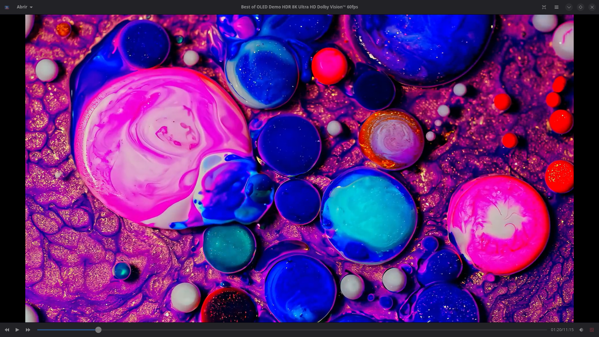
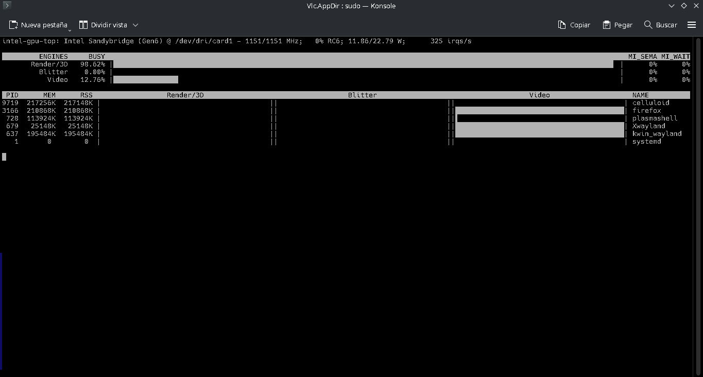

Celluloid AppImage VA-API Ultra Lightweight Edition

  

 A truly portable Celluloid AppImage with VA-API hardware video acceleration.  Lightweight, optimized and designed for modern Linux systems. 

Overview

This project provides an ultra lightweight AppImage of Celluloid, featuring VA-API hardware video acceleration and a custom portability patch.

Unlike the original application, this build has been modified to work correctly as a portable AppImage without relying on fixed system installation paths.

Approximate AppImage size:

~1 MiB

Screenshots
Celluloid playing video

  

VA-API hardware acceleration

Hardware decoding verified using intel_gpu_top.

  

Main Features

✅ Ultra lightweight AppImage

✅ Real VA-API hardware acceleration

✅ Portable design

✅ Optimized AppDir layout

✅ Minimal runtime

✅ Uses the system MPV installation

Custom Source Code Modifications

This AppImage is not a stock build.

The original Celluloid source code was modified to improve portability.

Changes include:

Removed assumptions about fixed installation paths.
Improved runtime resource discovery.
Portable language loading.
Better AppImage compatibility.
Works correctly outside traditional Linux package installations.

These changes allow the application to behave as a truly portable executable.

System Requirements

This AppImage relies on the host Linux multimedia stack.

Required:

MPV installed
FFmpeg installed
VA-API drivers (recommended)

Example for Arch Linux / CachyOS:

sudo pacman -S mpv ffmpeg

Debian / Ubuntu:

sudo apt install mpv ffmpeg

Fedora:

sudo dnf install mpv ffmpeg
Included Inside the AppImage

Only the required portable runtime components are included.

Examples:

Celluloid executable
GSettings compiled schema
Desktop integration
Icons
AppRun launcher

Large multimedia libraries are intentionally not bundled.

Optimization

This AppImage was manually optimized.

Examples of optimizations:

Removed unnecessary runtime files.
Removed duplicated resources.
Optimized SVG assets.
Reduced bundled components.
Symbolic links used whenever appropriate.
Minimal AppDir layout.
VA-API Verification

Install:

sudo pacman -S libva-utils

Check support:

vainfo

Intel GPU monitoring:

intel_gpu_top

During playback the GPU video engine should be active.

Philosophy

This project follows a simple idea:

Bundle only what the application truly needs.

Instead of shipping large amounts of duplicated libraries, the AppImage takes advantage of the existing Linux multimedia stack while remaining portable.

License

Celluloid remains licensed under its original open-source license.

This repository contains the AppDir structure, helper files, documentation and the portability work required for this AppImage.
